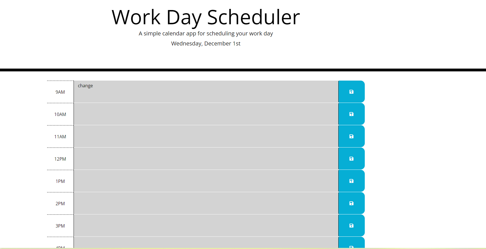

# Work-Day-Scheduler

```md
AS AN employee with a busy schedule
I WANT to add important events to a daily planner
SO THAT I can manage my time effectively
```

## Acceptance Criteria

```md
GIVEN I am using a daily planner to create a schedule
WHEN I open the planner
THEN the current day is displayed at the top of the calendar
WHEN I scroll down
THEN I am presented with timeblocks for standard business hours
WHEN I view the timeblocks for that day
THEN each timeblock is color coded to indicate whether it is in the past, present, or future
WHEN I click into a timeblock
THEN I can enter an event
WHEN I click the save button for that timeblock
THEN the text for that event is saved in local storage
WHEN I refresh the page
THEN the saved events persist
```

Created Work Day Scheduler based on acceptance criteria. I created this scheduler use JQuery, Bootstrap and Moment.js. First worte html for timeblocks based on CSS file to name id and class name. Then use Moment.js to format the header time. Use local storgae to save the text input, also use if condition function to set the timeblocks color based on current time. 

The screenshot of the application as bellow:


The deployed application link as bellow:
https://jing-liu-778.github.io/Work-Day-Scheduler/